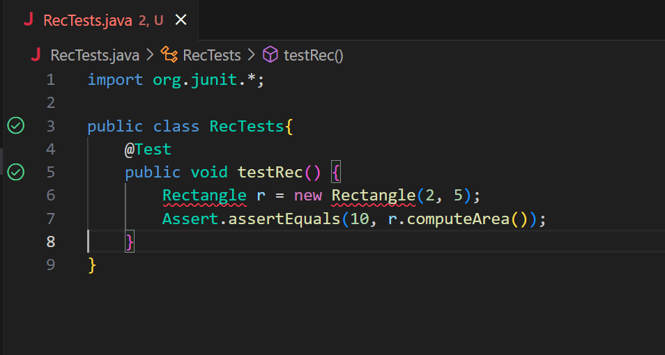
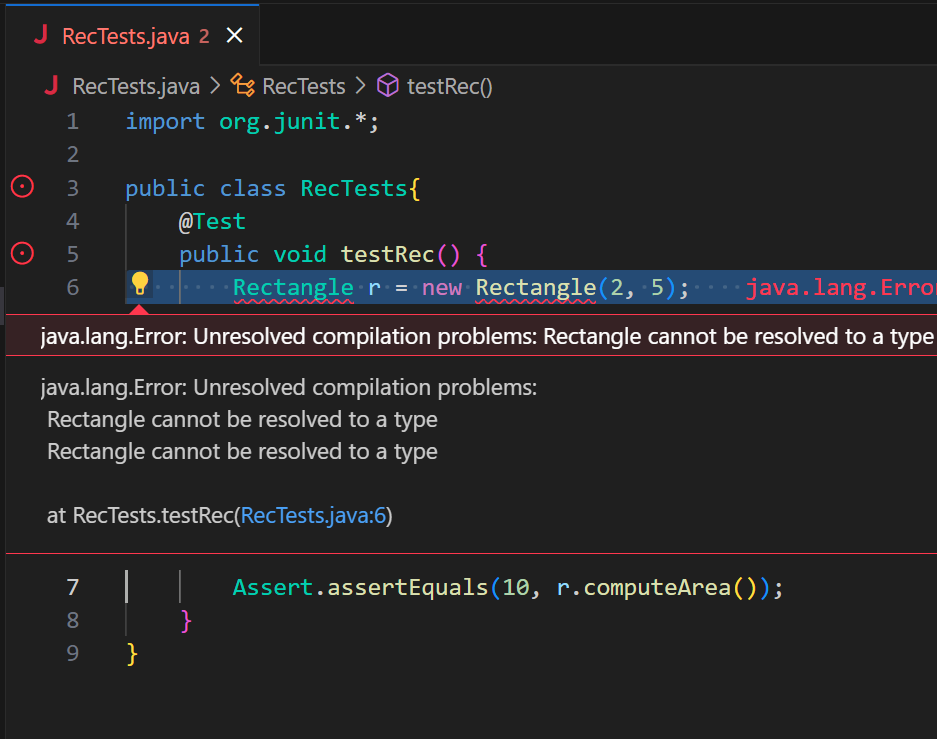
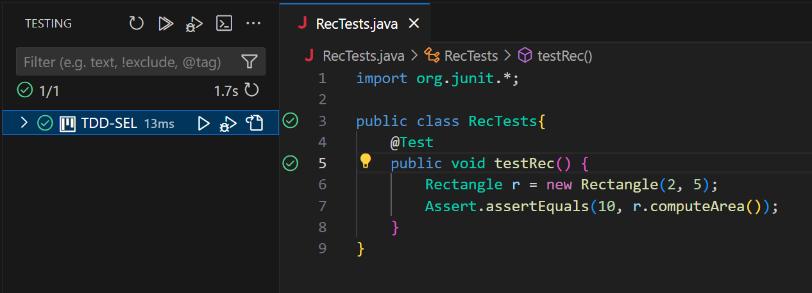
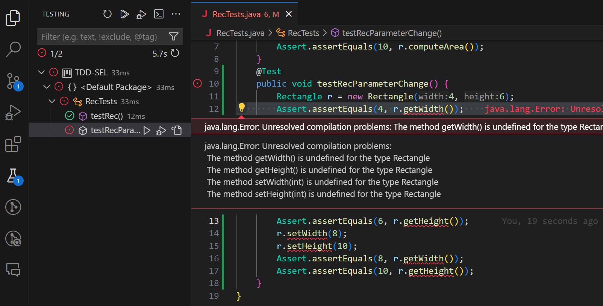
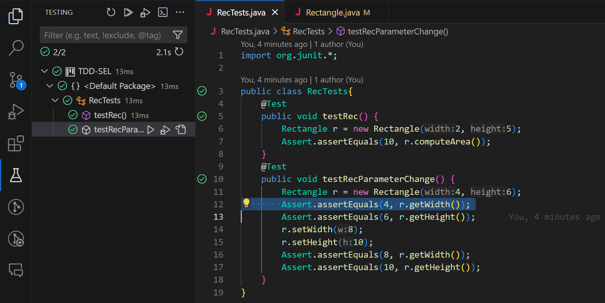
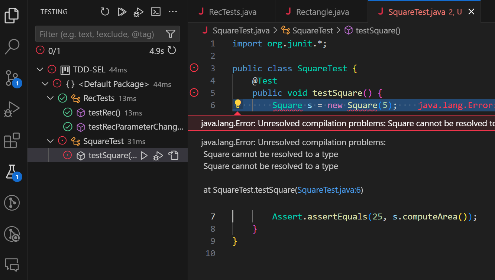
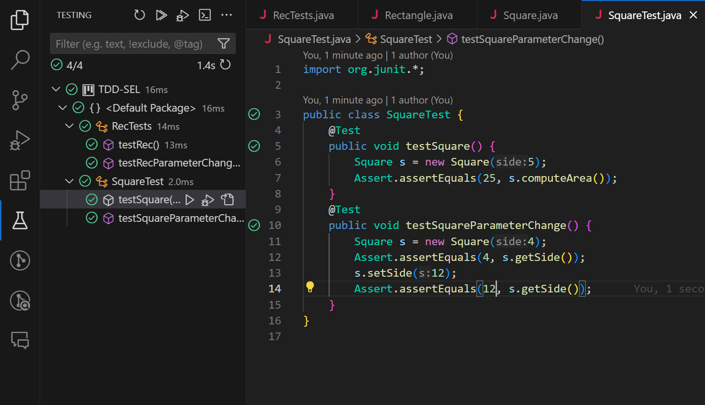
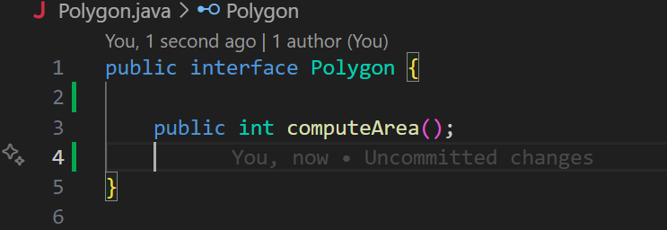

# گزارش آزمایش سوم

## مقدمه

در این آزمایش قصد داریم با روش ایجاد آزمون‌رانه (TDD)
یک پروژه ساده شامل دو کلاس مستطیل (Rectangle)
و مربع (Square)
یک رابط چند ضلعی (Polygon)
را پیاده‌سازی کنیم.

## فرآیند ایجاد پروژه

با توجه به اینکه از روش TDD استفاده می‌کنیم و بر اساس دستورکار داده شده، ابتدا تست مربوط به هر بخش را نوشته سپس کد مربوط به آن بخش را پیاده‌سازی می‌کنیم.

<b>توجه:</b>
همه بخش ها که تصویرشان ر ادامه آمده از روی کامیت ها به طور دقیق قابل بررسی است.

 در قدم اول تست تعیین مساحت مستطیل را 
با استفاده از کتابخانه JUnit
مینویسیم.

در ادامه آن را اجرا کرده، با توجه به خطای دریافتی کد مورد نیاز برای پاس کردن تست را پیاده‌سازی می‌کنیم.

برای بخش بعد تست تغییر طول و عرض مستطیل را مینویسیم و سپس کد مورد نیاز برای پاس کردن آن را پیاده‌سازی می‌کنیم.

و به همین صورت برای مربع نیز داریم:

تنها نکته قابل توجه در توسعه بخش مربع این است که چون باید از قواعد SOLID
پیروی کنیم و با توجه به اینکه مستطیل قابلیت تغییر طول و عرض را دارد، نباید مربع از مستطیل ارث بری کند؛
در عوض رابط چندضلعی را، که هر دو کلاس مربع و مستطیل از آن ارث میبرند، به صورت زیر تعریف میکنیم.

## پاسخ به پرسش‌ها

<b>سوال 1:</b>
 خیر، این روش تناقضی با روش معمول ندارد چرا طراحی تست را که ابتدا کار انجام میشود
 میتوان جز مراحل تحلیل و طراحی دانست؛
 طراحی تست در ابتدا کار باعث میشود تا نیازمندی ها را دقیق تر مشخص کنیم و در نتیجه فرآیند توسعه و پیاده سازی را دقیق تر و با کیفیت تر انجام دهیم.

<b>سوال 2:</b>

<b>تست واحد (ریزدانه):</b>
 در یک برنامه بانکی، آزمون واحد ممکن است بر روی یک تابع خاص تمرکز کند، مانند روشی که سود یک حساب پس انداز را محاسبه می کند.  
<b>
تست یکپارچه سازی (ریزه کاری سطح متوسط):</b>
 یک آزمون یکپارچه‌سازی در یک برنامه بانکی می‌تواند شامل بررسی تعامل بین اجزای مختلف باشد، مانند اطمینان از اینکه روش محاسبه سود به درستی با سیستم مدیریت حساب کلی تعامل دارد. 
<b>
تست سیستم (درشت دانه):</b>
 یک آزمایش سیستم ممکن است شامل آزمایش کل برنامه بانکی به عنوان یک سیستم منسجم باشد. این می تواند شامل سناریوهای انتها به انتها باشد، مانند ایجاد یک حساب جدید، سپرده گذاری، انجام محاسبه سود، و بررسی مانده نهایی برای اطمینان از عملکرد صحیح سیستم به عنوان یک کل. 
<b>
آزمون پذیرش (درشت ترین):</b>
 یک آزمون پذیرش بر تأیید اعتبار این نرم افزار متمرکز است که الزامات پروژه را برآورده می کند. در برنامه بانکی، یک آزمون پذیرش می‌تواند شامل سناریوهایی مانند تأیید این باشد که رابط کاربری به مشتریان اجازه می‌دهد تراکنش‌های رایج را با دقت و کارآمد انجام دهند.

 
<b> سوال 3:</b>
خیر، هر چند اغلب تست های واحد و یکپارچه سازی را برنامه نویسان طرح میکنند، اما
تست های دیگر، مانند تست سیستم (System Test)
، تست پذیرش (Acceptance Test)
و تست عملکرد (Performance test)
، ممکن است میتواند همکاری با متخصصان تضمین کیفیت (QA) یا متخصصان تست باشد که در کنار یا مستقل از تیم برنامه نویسی کار می کنند.

 
<b>سوال 4:</b>
اصول SOLID
در بخش طراحی در نظر گرفته شده و در طراحی کلاس ها، ماژول ها و روابط بین آن ها تاثیر گذار است. در ادامه مسیر توسعه نیز با توجه به طراحی صورت گرفته این اصول در فاز پیاده سازی، پیاده میشود.

 
<b>سوال 5:</b>
با فرض مطرح شده، بله میتوان این کار را انجام داد زیرا دیگر مشکل تبدیل شدن یک
مربع به مستطیل از طریق تغییر طول و عرض وجود ندارد. و همین طور نیازی به نقض اصول SOLID برای اینکه مربع عملکرددرستی داشته باشد نیست. 

